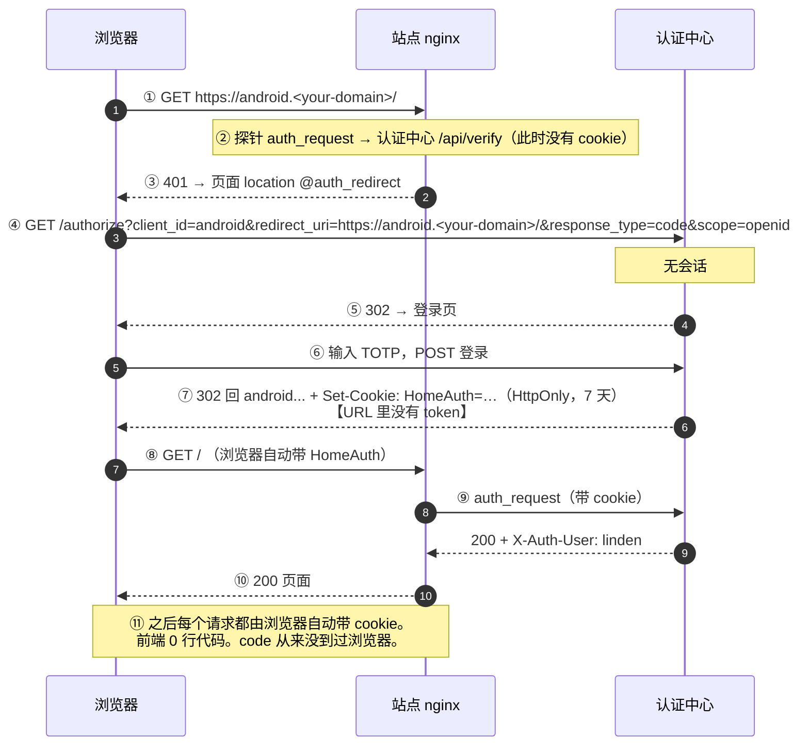
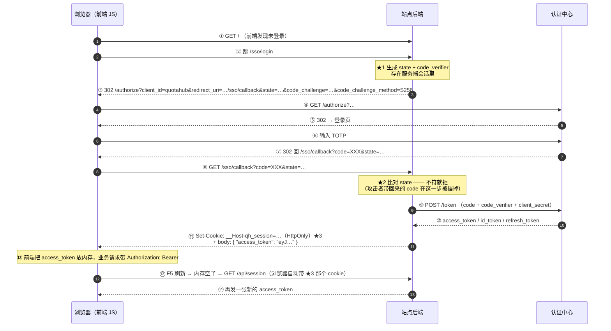

# SSO 时序图 · 两种形态对照

> ⚠️ 已被 docs/SSO-GATEWAY-SPEC.md 取代（2026-09-28 起全站走 Auth Gateway）。本文仅存历史设计记录。

> 2026-09-28 Hermes。都以本服务器真实的组件和域名画：浏览器 / 站点 nginx / 站点后端 / 认证中心（auth.<your-domain>，:3200）。

---

## 形态一：现在生产跑的（nginx 探针 + 共享 cookie）

适用于：`android` / `desktop` / `linux` / `memos` / `sy` / `sftpgo` / `changedetection` —— **别人的程序，没有我们能改的后端**。

**要点**：`code` 由认证中心自己消化 ✓ 浏览器只拿到一张 HttpOnly cookie ✓ **没有 state、没有 PKCE、没有续期逻辑** ✓

---

## 形态二：你要的那版（前端拿到 token）+ 它的完整性要求

适用于：`quotahub` / `v2link` / `admin-server` / `blog-server` / `davbox` —— **有我们自己能改的后端**。

**★ 标记的三处，就是形态二比形态一多出来的全部东西**：

| 标记 | 是什么 | 少了它会怎样 |
|---|---|---|
| ★1 ★2 | `state`（+ `code_verifier`） | 别人拿他自己的 code 构造一个 URL 让受害者打开 → 受害者活在他的账号里（会话固定 / 登录 CSRF） |
| ★3 | 一张 HttpOnly 的 **续期票** | 用户按 F5 就掉登录态（内存里的 token 没了，没东西能证明"还是我"） |

---

## 一句话对照

| | 形态一 ✓ 现在跑的 | 形态二 ✓ 你要的 |
|---|---|---|
| `code` 到得了浏览器吗 | **到不了** | 到得了（回调 URL 里） |
| 浏览器里存着什么凭证 | HttpOnly cookie（JS 看不到） | HttpOnly cookie（续期票）+ 内存 token（业务票） |
| 前端代码 | **0 行** | 拿 token / 存内存 / 刷新续期 |
| 必须实现的额外机制 | **无** | state ✓ PKCE ✓ 续期接口 ✓ |
| 攻击面 | 只有共享 cookie 跨子域这一点 | 加上"token 暴露给 JS"（XSS 可偷） |

**两张图里"每次请求必须带个东西"这件事是一样的** ✓ —— 区别只在：形态一那个东西 JS 碰不到 ✓ 形态二有两个，其中一个 JS 拿在手里 ✓
